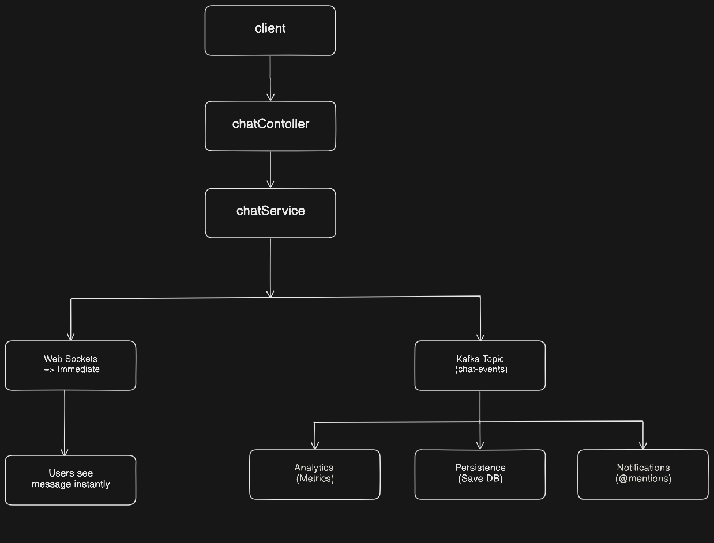

# workSync

A **scalable, event-driven backend** for **WorkSync** — a collaborative platform that brings together project management, real-time chat, notifications, and analytics.  
The backend focuses on **reliability, modularity, and real-time responsiveness**, using distributed systems patterns typically seen in production-scale systems.

---

## Architecture Overview

WorkSync follows a **Kafka-based event-driven design** where different parts of the system (like persistence, notifications, etc) run as **independent consumer groups**.  
This makes each component scalable and fault-tolerant on its own.

<p align="center">
  
</p>


This setup keeps the system responsive under load and makes it easy to extend — for example, by adding new consumers for analytics or alerting without touching the core logic.

For deep-dive diagrams and sequence flows, see [ARCHITECTURE.md](docs/ARCHITECTURE.md).

---

## Tech Stack Summary

**Core:** Java 17, Spring Boot 3.3, PostgreSQL, Apache Kafka  
**Infrastructure:** Docker, Docker Compose, Flyway  
**Security:** JWT (jjwt), BCrypt, Spring Security  
**Real-Time:** Spring WebSocket (STOMP over SockJS)  

---

## Getting Started

### Prerequisites
- **Java 17** or higher
- **Docker** and **Docker Compose**
- **Maven** (or use included `mvnw`)

### Quick Start

1. **Clone the repository:**
   ```bash
   git clone https://github.com/sk-pathak/workSync-backend.git
   cd workSync-backend
   ```

2. **Configure environment variables** (optional):
   ```bash
   cp .env.example .env
   # Edit .env with your settings (DB credentials, JWT secret, etc.)
   ```

3. **Build the application:**
   ```bash
   chmod +x mvnw
   ./mvnw clean package -DskipTests
   ```

4. **Start all services:**
   ```bash
   docker-compose up --build
   ```
   
   This will start:
   - PostgreSQL (port 5432)
   - Kafka + ZooKeeper (port 9092)
   - Spring Boot app (port 8080)

5. **Verify the application:**
   ```bash
   curl http://localhost:8080/api/auth/register -X POST \
     -H "Content-Type: application/json" \
     -d '{"username":"testuser","email":"test@example.com","password":"Test123!","name":"Test User"}'
   ```

### Development Mode

**Run without Docker (requires local PostgreSQL + Kafka):**
```bash
./mvnw spring-boot:run
```

**Run tests:**
```bash
./mvnw test
```

**Run with specific profile:**
```bash
./mvnw spring-boot:run -Dspring-boot.run.profiles=dev
```

### Database Migrations

Flyway automatically runs migrations on startup. To add a new migration:

1. Create SQL file: `src/main/resources/db/migration/V{number}__{description}.sql`
   - Example: `V11__add_user_preferences.sql`
2. Restart the application or run: `./mvnw flyway:migrate`

**Migration naming convention:**
- `V` prefix (version)
- Sequential number (e.g., `11`, `12`)
- Double underscore separator `__`
- Descriptive name (snake_case)

---

## Security
- All endpoints (except `/api/auth/*` and public project listing) require JWT authentication.
- Role-based access enforced via `@PreAuthorize` and service checks.
- WebSocket connections require JWT in the handshake.
